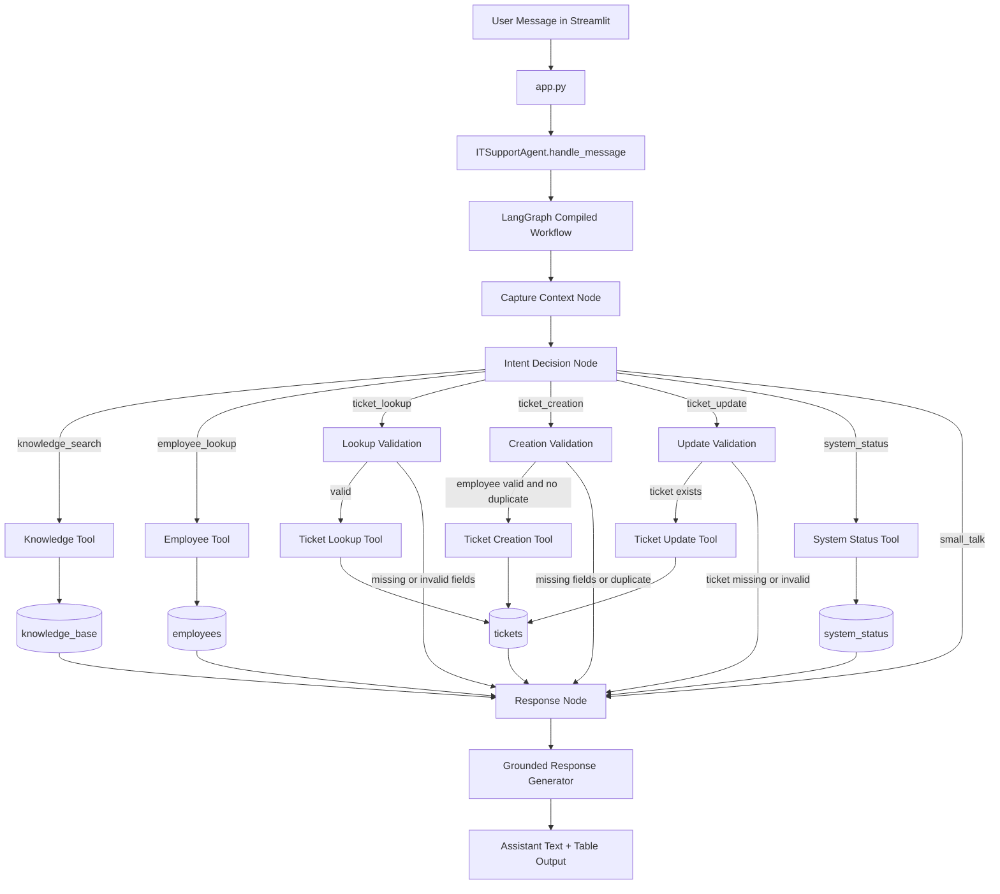
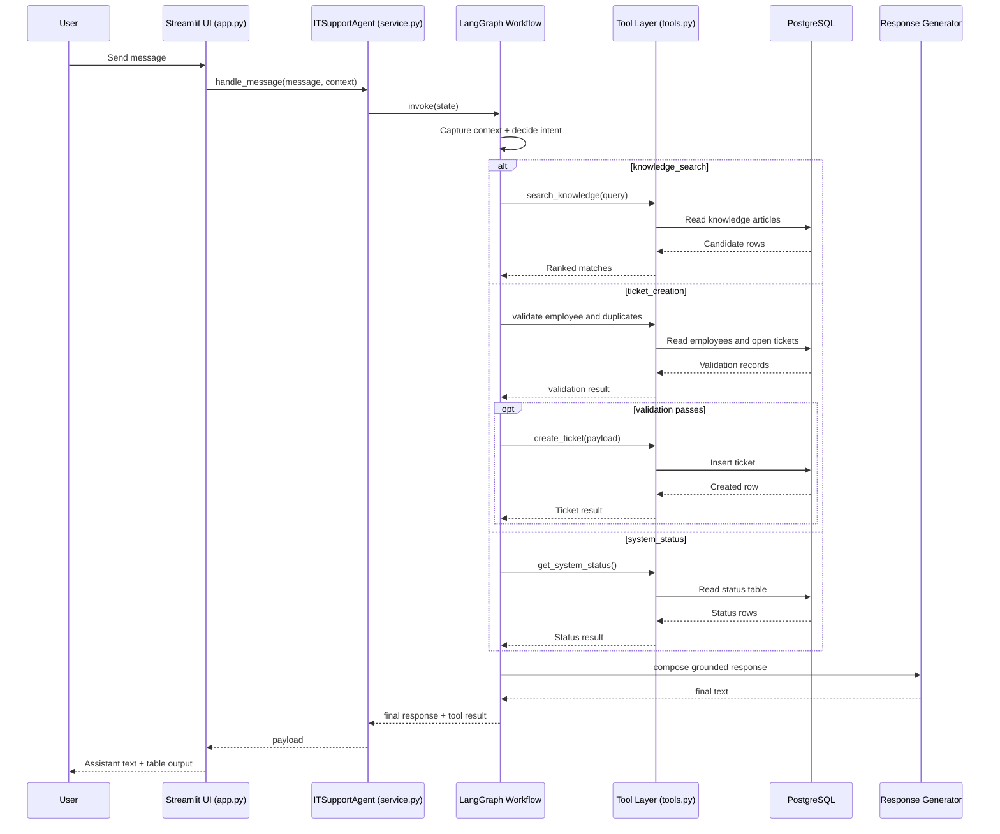
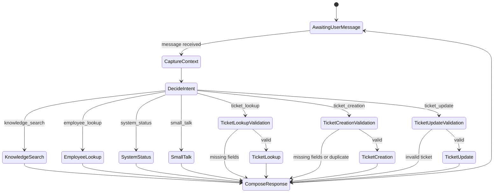
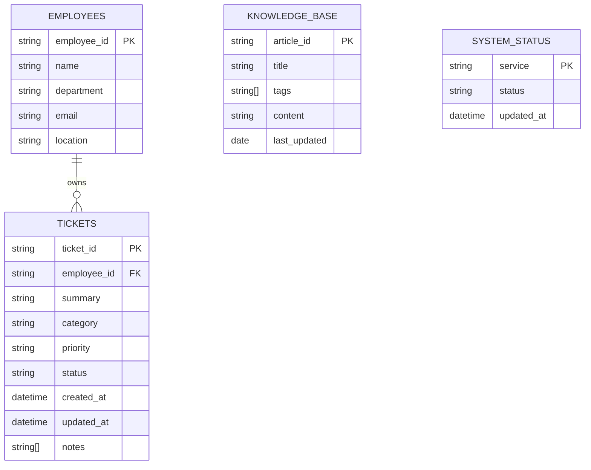
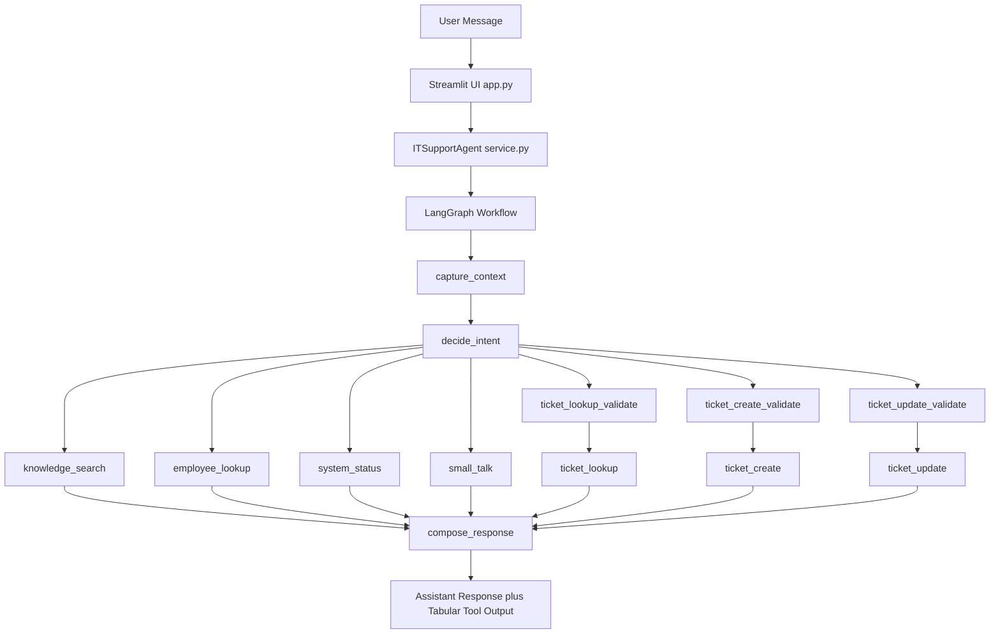
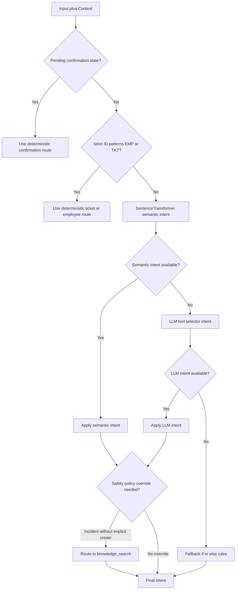
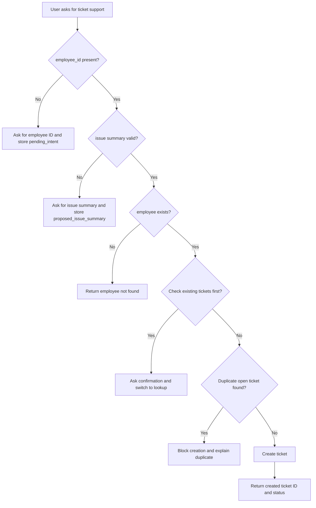
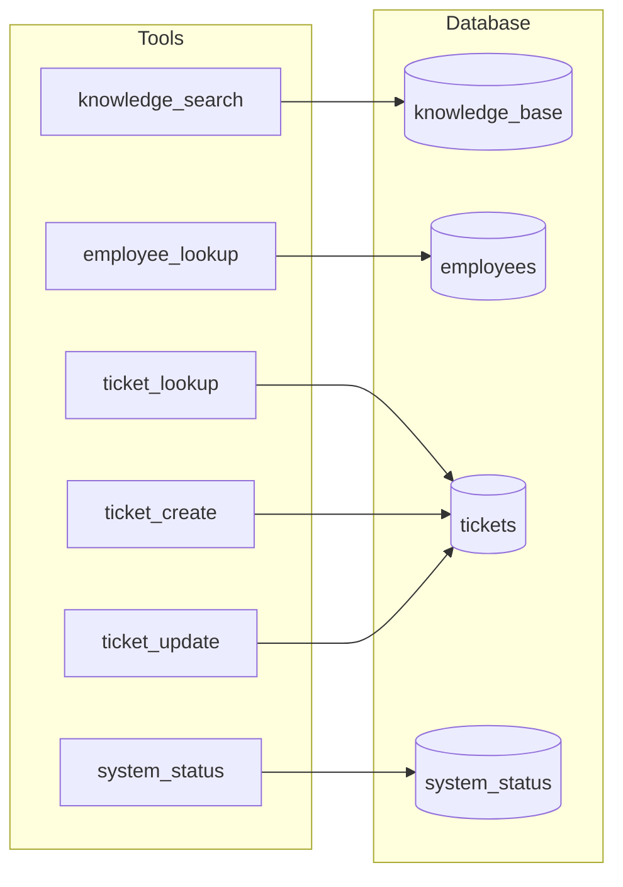

# AI IT Support Assistant Architecture

## 1) System Overview
This project is a stateful AI IT support assistant built with a LangGraph workflow and a Streamlit chat interface.

Main responsibilities:
- Understand user request intent.
- Route to the correct local tool.
- Validate required fields before write actions.
- Maintain conversation state across turns.
- Return user-friendly responses and tabular business output.

## 2) Runtime Components
- UI Layer: Streamlit app in app.py.
- Service Layer: ITSupportAgent in src/service.py.
- Orchestration Layer: LangGraph workflow in src/agent_graph.py.
- Intent + Response LLM Layer: src/llm_router.py.
- Tool Layer (Local Data Access): src/tools.py.
- Persistence Layer: PostgreSQL schema/seed via SQLAlchemy in src/models.py and src/database.py.
- Config Layer: environment-driven settings in src/config.py.

## 3) Data Model
Core tables:
- employees
- knowledge_base
- tickets
- system_status

ORM models are defined in src/models.py. Startup schema initialization and data seeding are handled in src/database.py.

## 4) End-to-End Request Flow
1. User sends message in Streamlit chat.
2. app.py forwards message and current context to ITSupportAgent.handle_message.
3. service.py invokes compiled LangGraph with state input.
4. agent_graph.py updates context, determines intent, validates inputs, executes tool node, and composes response.
5. llm_router.py enhances final response phrasing using grounded tool output.
6. app.py renders final message and structured table from tool trace.

### 4.1) Application Flow Diagram

## 5) LangGraph Design
State object (src/state.py) carries:
- user_input, intent
- context dictionary for memory
- missing_fields
- pending_intent and confirmation flags
- tool_result
- final_response

Primary node categories:
- Context Capture: extracts EMP/TKT identifiers and prior turn memory.
- Intent Decision: rule-first checks plus LLM classifier fallback.
- Validation Nodes: ensure required fields and policy checks.
- Tool Nodes: execute knowledge/ticket/employee/status operations.
- Response Node: produce grounded final response.

## 6) Intent and Routing Strategy
Hybrid strategy:
- Deterministic rules for critical patterns (ticket IDs, count queries, update commands, confirmation states).
- LLM intent classification for flexible natural language.

Current routed intents:
- knowledge_search
- employee_lookup
- ticket_lookup
- ticket_update
- ticket_creation
- system_status
- small_talk

## 7) Stateful Conversation Behavior
State memory is used to support multi-turn workflows, including:
- Capturing employee ID after issue statement.
- Reusing proposed issue summary when user provides follow-up inputs.
- Asking whether to check existing tickets before creating new ticket.
- Continuing ticket creation after confirmation.

Example supported flow:
- User: I have a VPN issue.
- Agent: Please share employee ID.
- User: EMP1024.
- Agent: I found your profile. Would you like me to check existing tickets?
- User: Yes.
- Agent: checks existing tickets and asks if new ticket should be created.

## 8) Safety and Validation Controls
Implemented controls:
- Missing field validation before tool actions.
- Employee existence checks.
- Duplicate ticket prevention with token overlap threshold.
- Ticket update requires existing ticket ID.
- Graceful DB/tool failure handling.
- Grounded responses: no invented ticket facts.

## 9) Tooling Contract
Tool layer in src/tools.py provides:
- Knowledge retrieval (semantic + lexical fallback).
- Employee lookup.
- Ticket lookup by employee and ticket ID.
- Ticket creation.
- Ticket summary update.
- System status retrieval.

### 9.1) SentenceTransformer Usage
The knowledge retrieval path uses SentenceTransformer embeddings to improve matching quality for natural-language queries.

How it is used:
1. User query text is converted into an embedding vector.
2. Candidate knowledge articles are converted into embedding vectors.
3. Cosine similarity is calculated between query and article vectors.
4. Top-ranked articles are returned as semantic matches.
5. If embedding retrieval is unavailable or low-confidence, the tool falls back to lexical matching.

Why this matters:
- Handles paraphrased queries better than strict keyword matching.
- Improves relevance when users describe issues in different wording.
- Preserves reliability with deterministic lexical fallback.

Each tool returns structured payloads for:
- Business rendering (chat table)
- Safe downstream response generation

## 10) UI Behavior
Streamlit UI in app.py provides:
- Chat history
- Clear/reset conversation
- Error and startup warnings
- Tool/action trace (optional)
- Tabular rendering of structured tool outputs

## 11) Failure Modes and Fallbacks
- DB unavailable: startup warning and safe runtime messages.
- Semantic retrieval unavailable: lexical fallback path.
- LLM response generation failure: deterministic fallback response.
- Unknown user wording in confirmation state: state-preserving fallback handling.

## 12) Testing Strategy
Unit tests in tests/test_agent_graph.py validate:
- Intent routing
- Multi-turn state continuity
- Ticket creation/update flows
- Duplicate prevention
- No-match knowledge fallback to stateful ticket support

Database model tests in tests/test_database.py validate schema expectations and DSN normalization behavior.

## 13) Extension Points
Recommended future extensions:
- Confidence scoring and observability per intent decision.
- Fine-grained retrieval evaluation set.
- Role-based access controls.
- Alembic migrations for schema evolution.
- Additional ticket lifecycle actions (close/reopen/assign).

## 14) Input and Output Examples
The following examples reflect expected behavior for evaluator testing.

### Example A: Knowledge Search
Input:
- User: How do I reset my VPN password?

Flow:
- Intent: knowledge_search
- Tool: Knowledge retrieval (SentenceTransformer semantic ranking + lexical fallback)

Output:
- Assistant response summarizing the steps.
- Structured result with article reference, for example article_id KB-001.

### Example B: Ticket Lookup by Employee
Input:
- User: What is the status of my laptop issue? EMP1024

Flow:
- Intent: ticket_lookup
- Validation: employee_id present
- Tool: ticket lookup by employee

Output:
- Assistant response with latest matching ticket status.
- Structured result containing ticket_id, summary, status, priority, and timestamps.

### Example C: Stateful Ticket Creation
Input sequence:
- User: My VPN is not working. Please raise a ticket.
- Agent: asks for employee ID
- User: EMP3001

Flow:
- Intent: ticket_creation
- Validation: employee exists
- Duplicate check: recent open tickets
- Tool: ticket creation when validations pass

Output:
- Assistant response confirming ticket creation.
- Structured result including generated ticket_id, employee_id, summary, and status.

### Example D: Ticket Update
Input:
- User: Update TKT1001 summary to VPN disconnects during video meetings.

Flow:
- Intent: ticket_update
- Validation: ticket exists
- Tool: ticket update

Output:
- Assistant response confirming update.
- Structured result including ticket_id, updated summary, and updated_at.

### Example E: Missing Information Path
Input:
- User: Check my ticket status.

Flow:
- Intent: ticket_lookup
- Validation fails due to missing employee_id or ticket_id

Output:
- Assistant asks for required identifier.
- No database write performed.

## 15) Additional Architecture Diagrams

### 15.1) Request Lifecycle Sequence Diagram

### 15.2) Conversation and Validation State Diagram

### 15.3) Data Model Relationship Diagram

## 16) How The Application Works (Updated)

This section summarizes the current runtime behavior with the latest routing and safety controls.

### 16.1) High-Level Runtime Pipeline

### 16.2) Intent Decision Priority

### 16.3) Ticket Creation Safety Path

### 16.4) Data Layer and Tool Mapping

